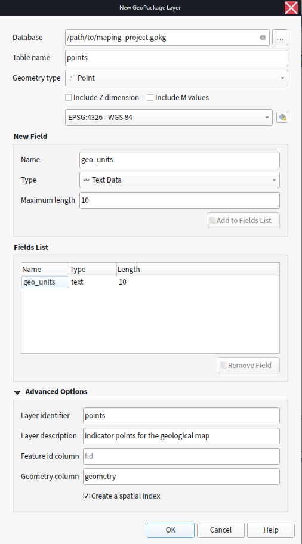
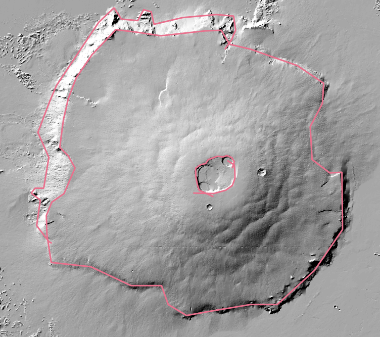
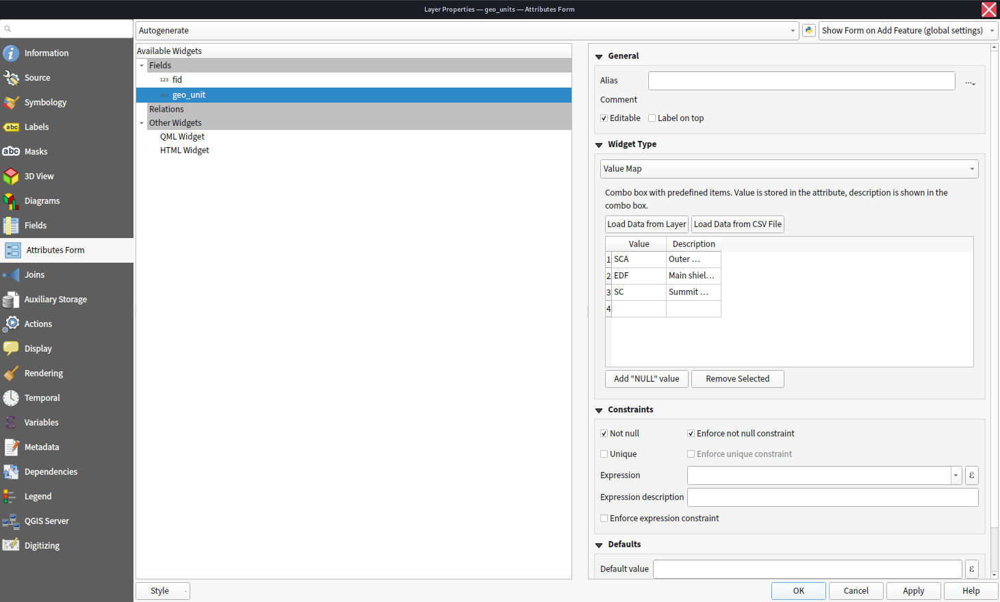
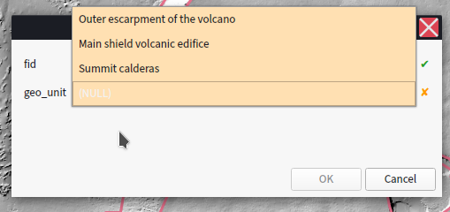
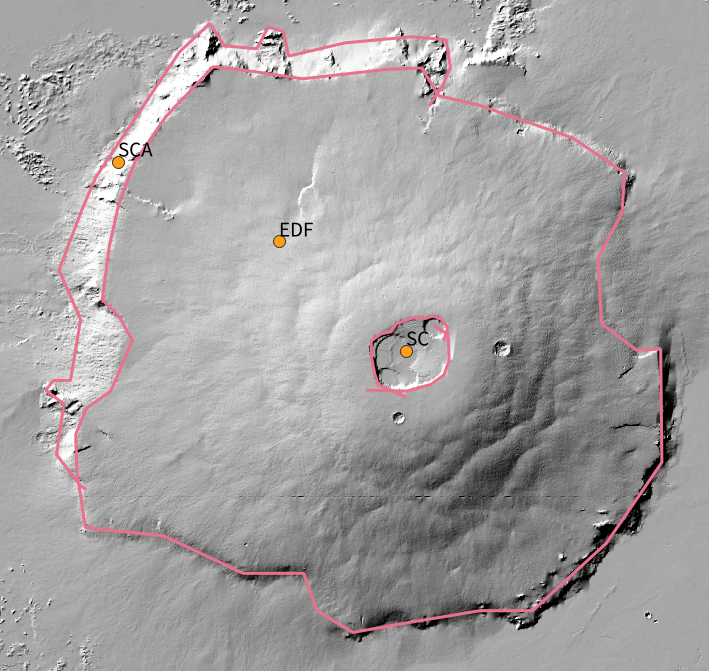
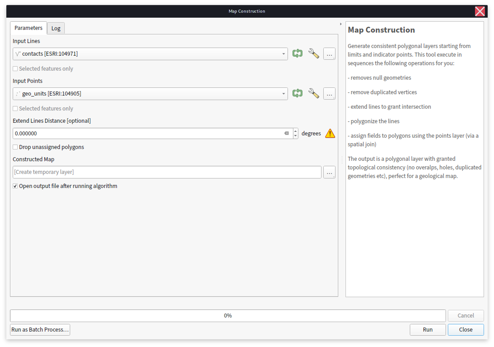
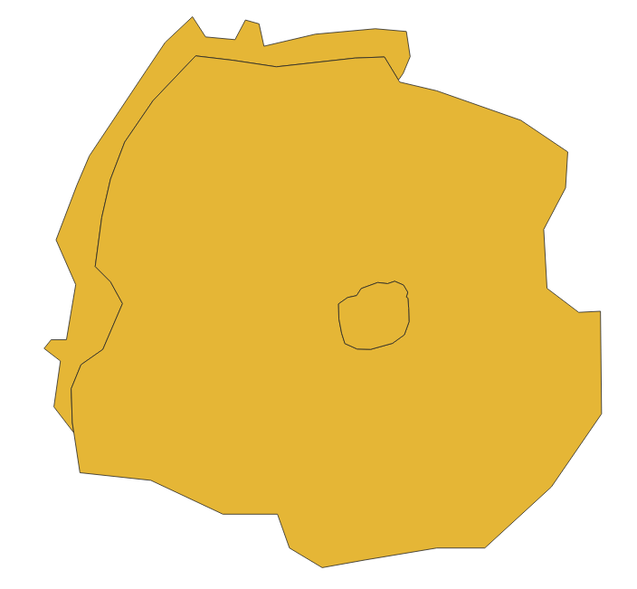
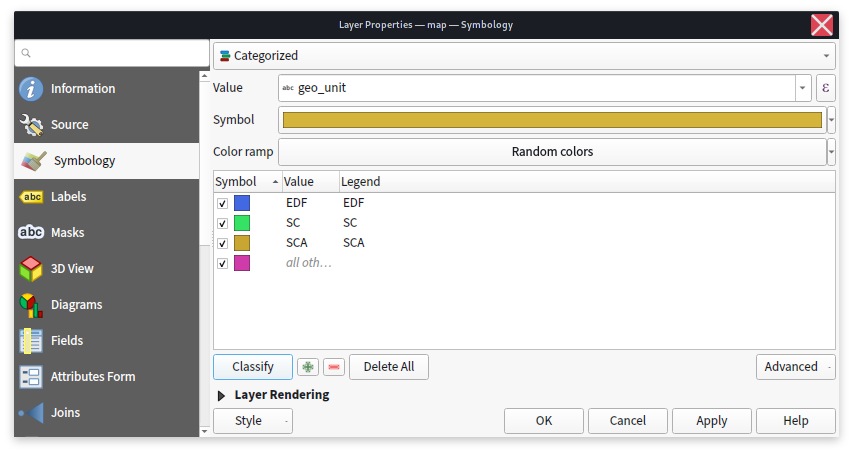
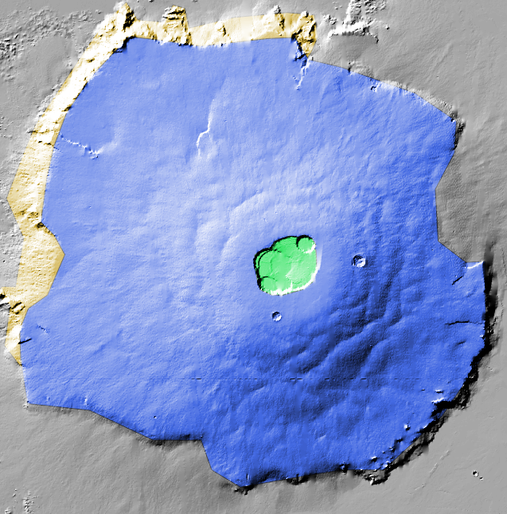
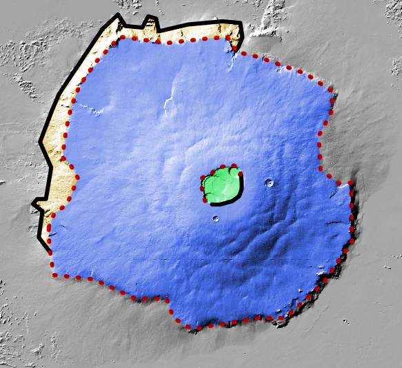

title: Mappy tutorial
category: Documentation.Mapping


Mappy is a QGIS plugin that simplify some useful operations needed to create geological maps by the point-and-contacts principle.

## Initial setup

Two different layers should be created:
- A line layer (either Line or MultiLine). The associated fields are not mandatory, but you might want to consider adding a couple of fields like ```certainty``` and/or ```type``` to represent the type of contact you are tracing. Keep in mind that more information you add to your vector data, more easy will be to style them later or to reuse them for other purposes.
- A point layer. Here we need at least one field that will be used as unique identifier for each geological unit that will be mapped. Choose for example ```geo_units```.

---
**Note**

Take your time to establish the naming of your fields to be meaningful and readily understandable. The same apply for the layers. It will not influence mappy in any way, but it will help you creating a clean dataset.

---

The type of fields can be freely chosen, but it is highly suggested you try to define beforehand the entries that will be used when populating your map. For example a ```string/char``` field can be used as type for the ```geo-units``` field, but it might be difficult to be consistent when entering those long strings by hand (they could be easily misspelled), thus short names or a code for each unit might be preferable. 

---
**Note**

To avoid mistakes when typing in the name of the geological unit in a string field, you could define them beforehand customizing the [attribute form](https://docs.qgis.org/testing/en/docs/user_manual/working_with_vector/vector_properties.html#attributes-form-properties) used to enter the field's values. An ```Unique Values``` or a ```Value Map``` [widget](https://docs.qgis.org/testing/en/docs/user_manual/working_with_vector/vector_properties.html#edit-widgets) might be used for this task.

---

The layers can be created in any format supported by QGIS (e.g. ESRI Shapefiles), but we suggest organizing your work within a geopackage file. This open format make it possible to store within a single and portable file any number of different vector layers. To create a new geopackage use ```Layer> Create Layer> New Geopackage Layer``` or ```CTRL+SHIFT+N```.




<figcaption> 

Creating a new geopackage layer in QGIS with one point layer named ```points```, with one field ```geo_units```of type ```Text Data```. Once the geopackage is created new layers can be appended to the same file by selecting the same ```Database``` geopackage. The same operation should be performed for creating the line layer that will contain the contacts. **Remember to set a meaningful CRS for the layer**.

</figcaption>  


## Drawing the contacts

Assuming you have already loaded your basemaps you can now start tracing your contacts. Just enable the editing (use `Toggle Editing` from right-clicking on the layer) for your newly created layer and add new lines. Something very important that you should keep in mind is that you should not be focusing on the outline of each unit, but rather determine the contacts between the different units.





<figcaption> 

Example of linework on the [Olympus Mons](https://en.wikipedia.org/wiki/Olympus_Mons) volcanic edifice on Mars, we used the lines to define the contacts between different morphological units. Notice that the linework does not need to be precise (here exaggerated), we just need the line to be intersecting to correctly define the units. Also multiple lines can be used to define one contact, provided they all intersect each other (see the calderas on the summit).

</figcaption>  


## Defining indicator points

The next step consist in labelling each region we have identified with the contacts. To do so a point layer will be used: a new point will be placed anywhere within the given unit and its fields will be populated accordingly.

We will use the following unit's shortcuts:

| code | description |
--- | --- |
| SCA | Outer escarpment of the volcano |
| EDF | Main shield volcanic edifice|
| SC | Summit calderas |

and populate the points layer. If you want you can setup dedicated field widget to ease this work (`Right Click on Layer >Properties> Attributes Forms> `).



<figcaption> 

Example of attribute form set up with the predefined unit's names (notice you can also create them as a CSV file to load).

</figcaption>  

After enabling the point layer for editing we add new points by left-clicking with the mouse in the location of interest. You must activate the adequate tool for adding new points (look for `Add Point Feature` button or use `CTRL+.`). For each unit you will need to enter the corresponding unit. If you set up a dedicated `Attribute form` the dialog will look something like this: 



<figcaption> 

Example of Feature Attribute Dialog, customized with a `Value Map` field widget. It ensures no wrong codes can can be inserted into the database.

</figcaption>  


After adding all the needed points the results should be something like this:



<figcaption> 

Example of points used to define the names of the units. Short-codes were used to uniquely identify the unit. To show the labels follow `Right-Click on layer> Properties> Labels` and configure accordingly.

</figcaption>  


Remember to save the layers by using the `Save Layer Edit` in the `Digitizing` toolbar.


# Map generation

We can now use Mappy to generate a new polygonal layer that can be used for printing the map. The mappy tools can be found within the `Toolbox` under `Mappy`. We are especially interested into the `Map Construction` processing tool where we need to select the layers that will be used as contacts and the one that represent the points.




There are not many options here but at the present implementation we have:
- Extend Line Distance. Is the distance in map-units that will be used to extend each end segment of the lines. This might be useful if some of your lines do not intersect by a minimum distance. Of course is better to fix the problem by modifying the contacts layer itself.
- Drop unassigned polygons. If selected, mappy will not produce polygons that were not assigned with the point layer.
- Constructed Map. Is where the output will be placed.


After the map is generated it will look like this:




Mappy generated the polygonal layer for you and added the properties defined within the point layer. You can verify this by opening the attribute table for the polygonal layer:


The map can then be styled with `Right-click on Layer> Properties> Symbology`. A `Categorized` symbology might be used, like so (you can use the `Classify` button to automatically add all your unit's definitions, also remember to modify the `Legend` items if you want a full description of the map in the printing layout):



---
**Note**

The default value for `Constructed Map` option is to create a temporary layer every time the algorithm is run. During the mapping you might want to run the algorithm many times to have a peek at how your final map will look like. To avoid having to restyle everytime the newly generated map you could just set this option to overwrite a file on disk (e.g. a layer within your geopackage). In this way mappy can be run and QGIS will automatically find out that the layer was changed, and it will reload it (you can force the reloading by pressing `F5` if needed).

Alternatively you can use the tool `Map Automatic Styling`, privided by mappy to quick-style your newly created map.

---

your map might look like this:





---
**Note**

To enable this kind of transparency find the `Blending Mode` option under the layer's `Symbology> Layer Rendering` dialog, and set it to `Overlay`

---

## Optional: style the contacts 

**This is an experimental feature**

Sometimes it might be useful to also style the contacts depending on their meaning or other qualities.
For this task mappy provides the `Remove Dangles` tool which can remove any dangling line end or start to produce a new contacts layers, free of any imprecision that the operator used during mapping. The original attributes are retained and can be used to style the contacts:




<figcaption> 

In this example we cleaned the original contacts with `Remove Dangles` and used a different style depending on the `type` attribute of the contacts. This feature make it possible to re-use the contacts for layout purposes. Notice you might want to set the `Stroke Stile` to `No Pen` for the polygonal layer, or the contacts will be duplicated multiple times.

</figcaption>  


---
**Note**

The same considerations for the styling apply to the contacts, if you need to regenerate them many times it is better to just overwrite the same layer on disk. In this way QGIS will remember the style settings for that layer. If needed use `F5` to reload the layer

---